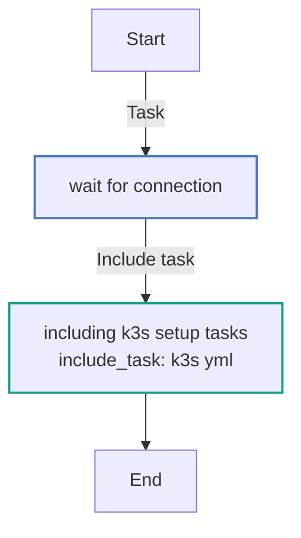

<!-- DOCSIBLE START -->

# 📃 Role overview

## ansible-role-k3s

Description: An Ansible Role that installs and configures a single node K3s cluster

### Defaults

**These are static variables with lower priority**

#### File: defaults/main.yml

| Var          | Type         | Value       |Required    | Title       |
|--------------|--------------|-------------|-------------|-------------|
| [k3s_install_options](defaults/main.yml#L2)   | str   | `--disable traefik,servicelb,metrics-server --node-label=role=core` |    n/a  |  n/a |
| [k3s_reconfigure](defaults/main.yml#L3)   | bool   | `False` |    n/a  |  n/a |
| [k3s_kubeconfig_local_path](defaults/main.yml#L4)   | str   | `/tmp/k3s-kubeconfig` |    n/a  |  n/a |
| [k3s_kubeconfig_server](defaults/main.yml#L5)   | str   | `127.0.0.1` |    n/a  |  n/a |

### Tasks

#### File: tasks/k3s.yml

| Name | Module | Has Conditions |
| ---- | ------ | --------- |
| Check if SELinux is installed | find | False |
| Configuring SELinux in permissive mode | ansible.posix.selinux | True |
| Ensure Firewalld/Iptables service are stopped | service | False |
| Check if K3S is already installed | stat | False |
| Install K3S if not installed or if variable 'k3s_reconfigure' is set to 'true' | shell | True |
| Start & Enable k3s systemd service | systemd_service | False |
| Replace server address in K3s kubeconfig with the instance ip | replace | False |
| Copy kubeconfig file locally as "{{ k3s_kubeconfig_local_path }}" | ansible.builtin.fetch | False |

#### File: tasks/main.yml

| Name | Module | Has Conditions |
| ---- | ------ | --------- |
| Wait for connection... |  | False |
| Including K3s setup tasks | include_tasks | False |

## Task Flow Graphs

### Graph for k3s.yml

```mermaid
flowchart TD
Start
classDef block stroke:#3498db,stroke-width:2px;
classDef task stroke:#4b76bb,stroke-width:2px;
classDef includeTasks stroke:#16a085,stroke-width:2px;
classDef importTasks stroke:#34495e,stroke-width:2px;
classDef includeRole stroke:#2980b9,stroke-width:2px;
classDef importRole stroke:#699ba7,stroke-width:2px;
classDef includeVars stroke:#8e44ad,stroke-width:2px;
classDef rescue stroke:#665352,stroke-width:2px;

  Start-->|Task| Check_if_SELinux_is_installed0[check if selinux is installed]:::task
  Check_if_SELinux_is_installed0-->|Task| Configuring_SELinux_in_permissive_mode1[configuring selinux in permissive mode<br>When: **selinux result files   length   0**]:::task
  Configuring_SELinux_in_permissive_mode1-->|Task| Ensure_Firewalld_Iptables_service_are_stopped2[ensure firewalld iptables service are stopped]:::task
  Ensure_Firewalld_Iptables_service_are_stopped2-->|Task| Check_if_K3S_is_already_installed3[check if k3s is already installed]:::task
  Check_if_K3S_is_already_installed3-->|Task| Install_K3S_if_not_installed_or_if_variable__k3s_reconfigure__is_set_to__true_4[install k3s if not installed or if variable  k3s<br>reconfigure  is set to  true <br>When: **not k3s stat stat exists or k3s reconfigure**]:::task
  Install_K3S_if_not_installed_or_if_variable__k3s_reconfigure__is_set_to__true_4-->|Task| Start___Enable_k3s_systemd_service5[start   enable k3s systemd service]:::task
  Start___Enable_k3s_systemd_service5-->|Task| Replace_server_address_in_K3s_kubeconfig_with_the_instance_ip6[replace server address in k3s kubeconfig with the<br>instance ip]:::task
  Replace_server_address_in_K3s_kubeconfig_with_the_instance_ip6-->|Task| Copy_kubeconfig_file_locally_as__k3s_kubeconfig_local_path_7[copy kubeconfig file locally as  k3s kubeconfig<br>local path ]:::task
  Copy_kubeconfig_file_locally_as__k3s_kubeconfig_local_path_7-->End
```

### Graph for main.yml

## Author Information
https://www.linkedin.com/in/lucaesposito87/

#### License

MIT

#### Minimum Ansible Version

2.7

#### Platforms

- **Amazon Linux**: ['2']

<!-- DOCSIBLE END -->